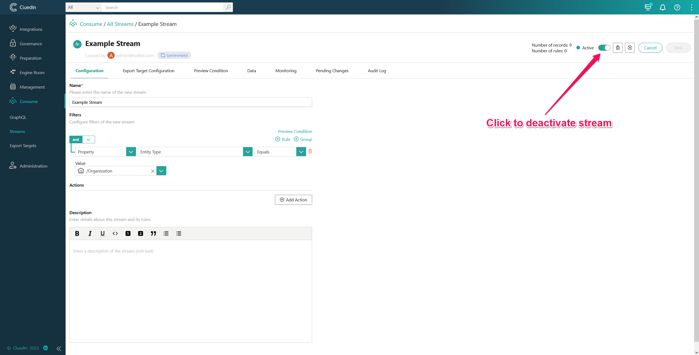
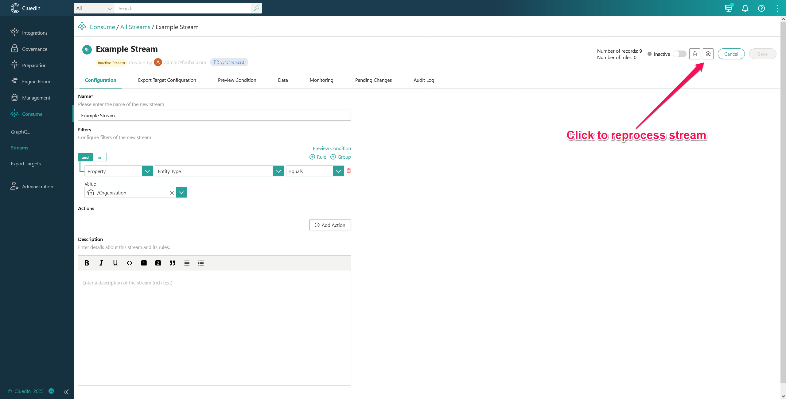

# 3.7.0 Upgrade notes
Since the schema is changing significantly, the following actions needs to be 
performed for all streams using SQL server connector:

## Disable the stream before upgrading
The stream needs to be disabled before upgrading. This is because the schema
has changed significantly, and the new version of the connector cannot store
data in the old schema. If you don't disable the connector before upgrading,
you likely experience a lot of errors, due to exceptions happening when trying
to store in the old tables.


## Update the dependency
You can now upgrade the package to the 3.7.0 version

## Reprocess the stream
You will now have to reprocess the stream. This will archive the existing
tables in the database, and create the new tables, that the connector needs.


## Activate the stream
You can now activate the stream again. This will cause all of the data that
satisfies the filter for the stream, to be streamed to the database.


### Additional notes
To bulk deactivate all streams, using SQL server connector, you can run the
following SQL command:

```sql
UPDATE [DataStore.Db.OpenCommunication].[dbo].[Streams]
SET [Active] = 0
WHERE [ConnectorProviderDefinitionId] IN (
    SELECT [Id]	
    FROM [DataStore.Db.OpenCommunication].[dbo].[OrganizationProvider]
    WHERE [ProviderId] = '838E4EA2-80E0-4B60-B1D1-F052BFCD0CAF')
```